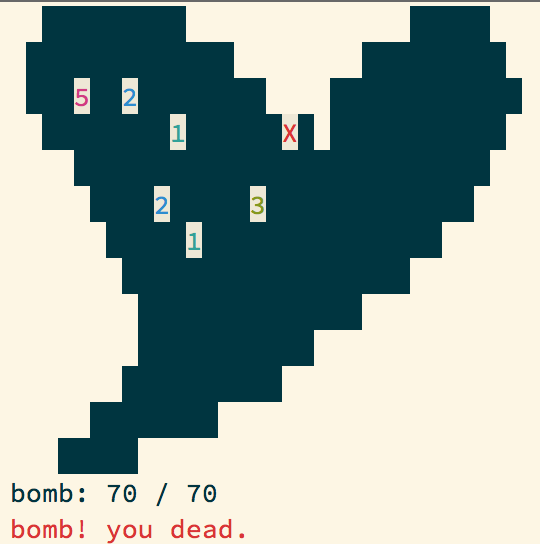
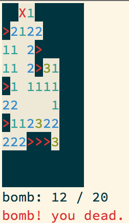

Minesweeper
===========



Installation
------------

``` console
$ go get github.com/k0kubun/go-termios
$ go get github.com/hanachin/minesweeper
```

Usage
-----

``` console
$ cd $GOPATH/src/github.com/hanachin/minesweeper
$ go run minesweeper.go
$ go run minesweeper.go --help
$ go run minesweeper.go -h 10 -w 10 -b 10
$ go run minesweeper.go -t heart -b 10
```
